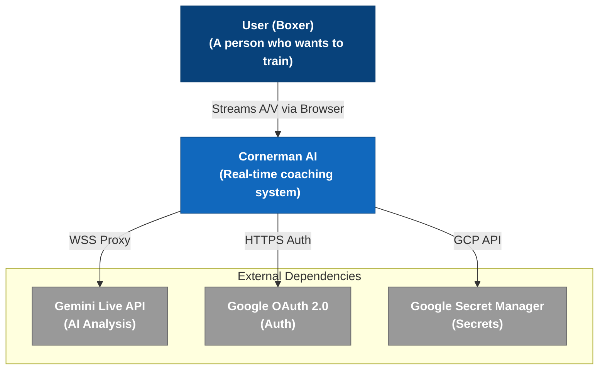

# Level 1: System Context Diagram

The System Context diagram provides a high-level overview of the Cornerman AI system, the user interacting with it, and the external systems it depends on.

## Elements

- **User (Boxer)**: The end-user of the application. They interact with the frontend via their browser, allowing access to the camera and microphone.
- **Cornerman AI**: The core system described in this documentation.
- **Gemini Live API**: The external AI service that processes the multimodal data and returns coaching feedback.
- **Google OAuth 2.0**: The external identity provider used to securely authenticate users.
- **Google Secret Manager**: The external system providing secure storage and retrieval for the application's sensitive environment variables and keys.
