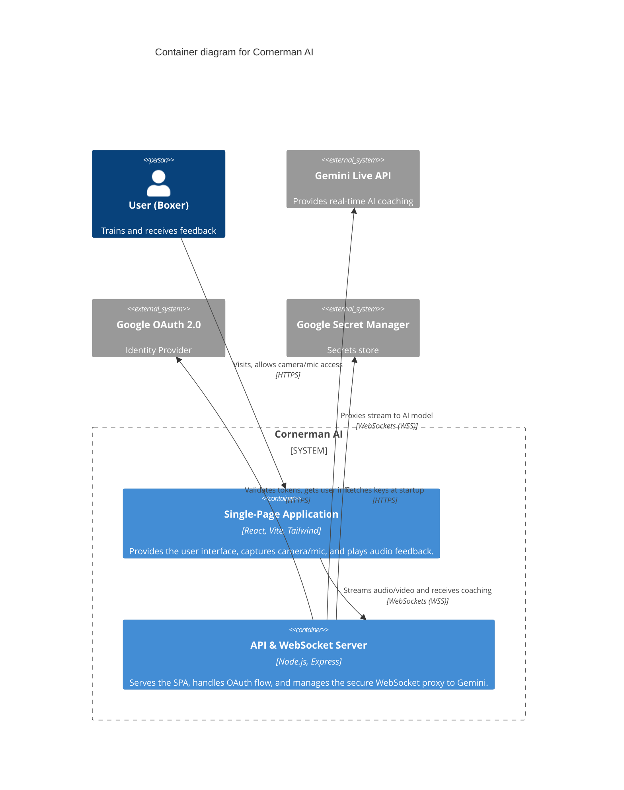

# Level 2: Container Diagram

The Container diagram zooms into the Cornerman AI system, showing the high-level technical structure and how the different containers communicate.

## Containers

- **Single-Page Application (SPA)**: Built with React and Vite. It runs in the user's browser, handles the visual UI, and utilizes standard browser APIs (WebRTC/MediaDevices) to capture audio and video. It converts the data to a compatible format before sending it to the backend.
- **API & WebSocket Server**: A Node.js and Express server. It has three main responsibilities:
  1. Serves the static SPA files (in production) or runs a Vite middleware (in development).
  2. Provides REST API endpoints for the Google OAuth 2.0 authentication flow and session management.
  3. Acts as a WebSocket proxy server. It accepts WebSocket connections from the SPA and opens a downstream WebSocket connection to the Gemini Live API, facilitating secure and authenticated real-time communication.
