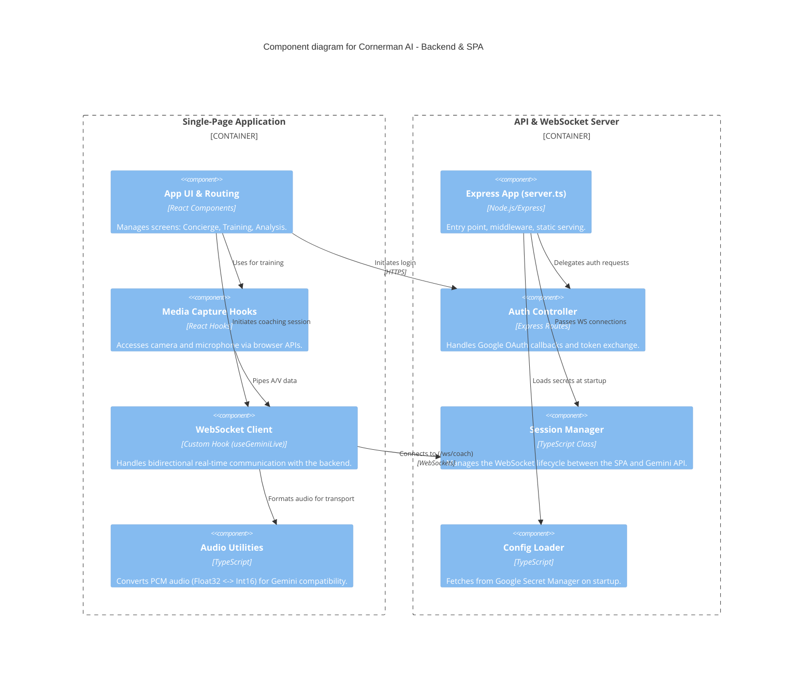

# Level 3: Component Diagram

The Component diagram shows the internal structure of the containers, outlining the key building blocks within the SPA and the Backend.

## Key Components

### Single-Page Application
- **App UI & Routing**: The top-level React application structure orchestrating the user flow across three main screens: Setup (Concierge), Active Session (Training), and Review (Analysis).
- **Media Capture Hooks**: Custom React hooks responsible for requesting permissions and reading continuous frames from the browser's `getUserMedia` API.
- **WebSocket Client (`useGeminiLive`)**: Encapsulates the logic for connecting to the backend WebSocket server, sending media payloads (base64 image frames, raw PCM audio), and receiving AI text/audio responses.
- **Audio Utilities**: Helper functions that convert Float32 audio recorded by the browser down to the Int16 16kHz format required by the Gemini Live API.

### API & WebSocket Server
- **Express App (`server.ts`)**: The core entry point configuring middleware, HTTP routing, and the WebSocket server attachment.
- **Auth Controller**: Express route handlers (`/api/auth/*`) that implement the OAuth 2.0 authorization code flow and store user data in a secure, encrypted cookie session.
- **Session Manager (`sessionManager.ts`)**: A specialized class instantiated per WebSocket connection. It manages the connection state, configurations (e.g., system instructions for the AI coach), and handles translating standard WebSockets into the specific format expected by the Google GenAI SDK.
- **Config Loader**: Initialization logic that attempts to fetch required secrets (like `GEMINI_API_KEY` and `GOOGLE_CLIENT_SECRET`) from Google Secret Manager during application startup, falling back to local environment variables if necessary.
