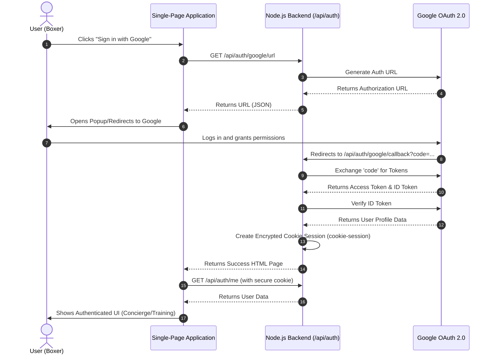

# Sequence Diagram: Authentication Flow

This diagram illustrates the Google OAuth 2.0 authentication process for Cornerman AI.

## Description

1. **Initiation**: The user initiates the login process from the frontend.
2. **URL Generation**: The backend securely generates the correct Google OAuth URL containing the necessary scopes and the `redirect_uri`.
3. **User Consent**: The user is redirected to Google's consent screen.
4. **Callback**: Google redirects the user back to the backend's callback URL with an authorization `code`.
5. **Token Exchange**: The backend securely exchanges this `code` for an access token and an ID token (using the `GOOGLE_CLIENT_SECRET`).
6. **Session Creation**: The backend verifies the user's identity and establishes a session using `cookie-session`, which sets a secure, HTTP-only cookie.
7. **Confirmation**: The SPA detects the successful login, fetches the user profile using the established cookie, and grants access to the application.
