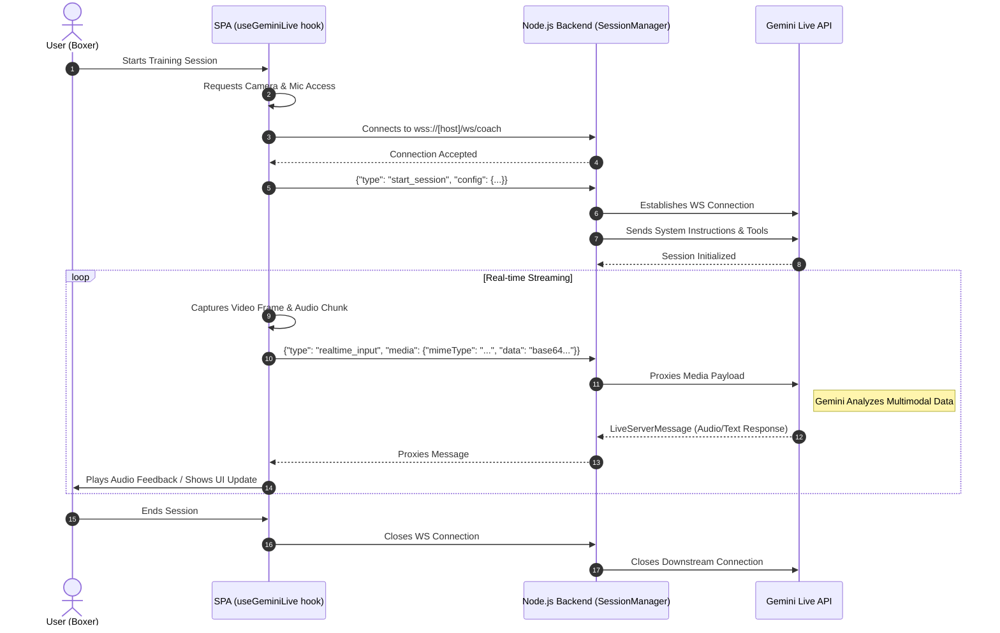

# Sequence Diagram: Live Training Session Flow

This diagram illustrates the real-time, low-latency communication flow during an active boxing training session, utilizing WebSockets and the Gemini Live API.

## Description

1. **Setup**: When the user starts a session, the SPA requests necessary hardware permissions (Camera, Mic) and opens a WebSocket connection to the backend proxy.
2. **Configuration**: The SPA sends a `start_session` message containing the chosen trainer personality, training plan, and duration. The backend's `SessionManager` initializes the connection to the Gemini Live API using these parameters as system instructions.
3. **Continuous Streaming**: The browser continuously captures video frames (as JPEG base64) and audio (converted to 16kHz Int16 PCM) and streams them to the backend over the WebSocket. The backend acts as a low-latency proxy, forwarding these payloads to Gemini.
4. **Real-time Feedback**: As Gemini processes the incoming audio and video streams, it streams back responses (primarily native audio). The backend proxies these back to the SPA, which decodes and plays the audio for the user, creating a seamless conversational coaching experience.
5. **Teardown**: When the user finishes or closes the tab, the WebSockets are cleanly disconnected on both sides.
